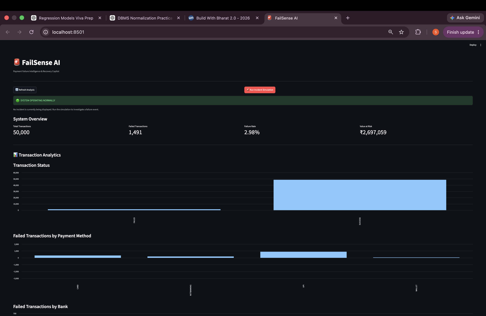
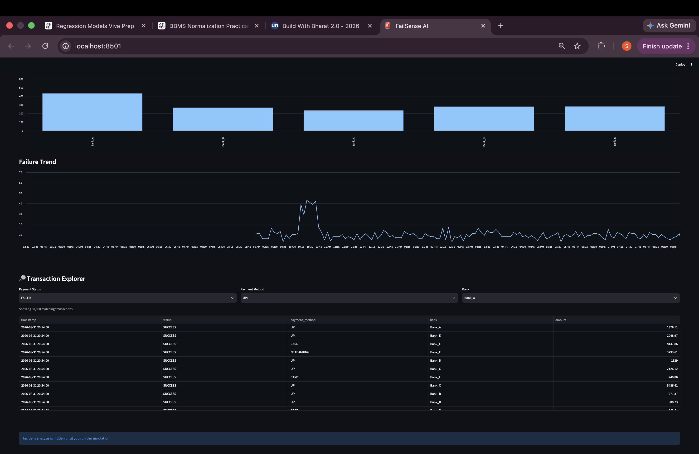
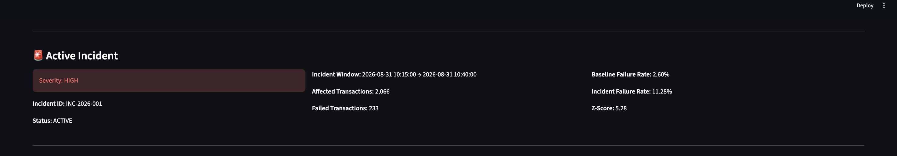
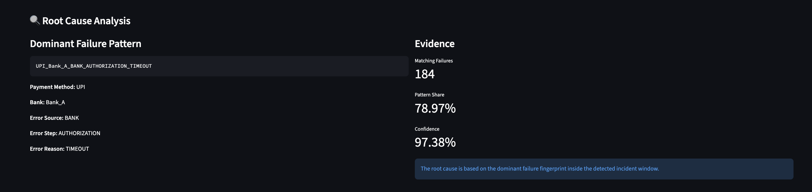
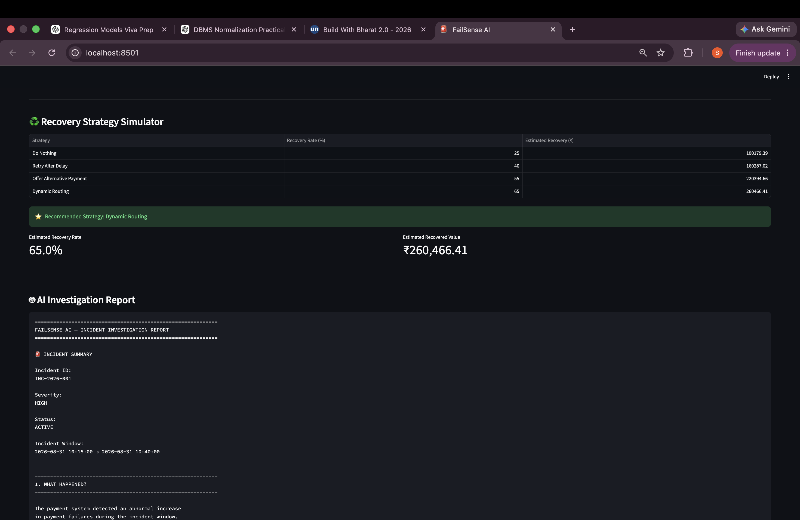
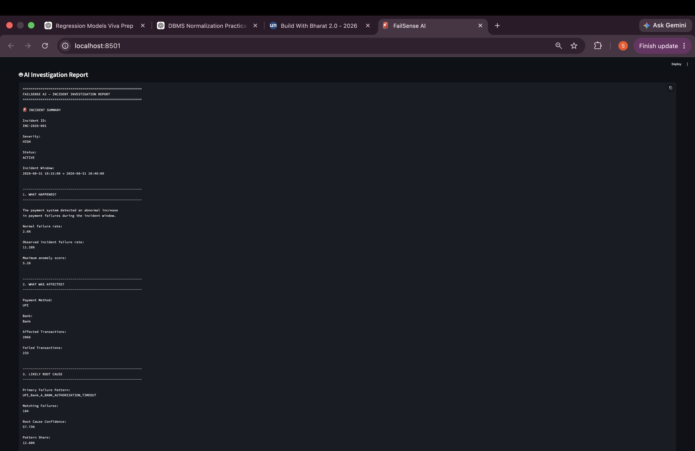
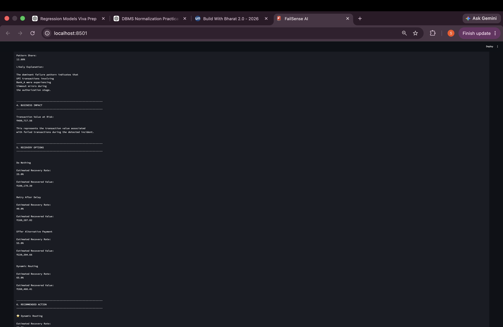
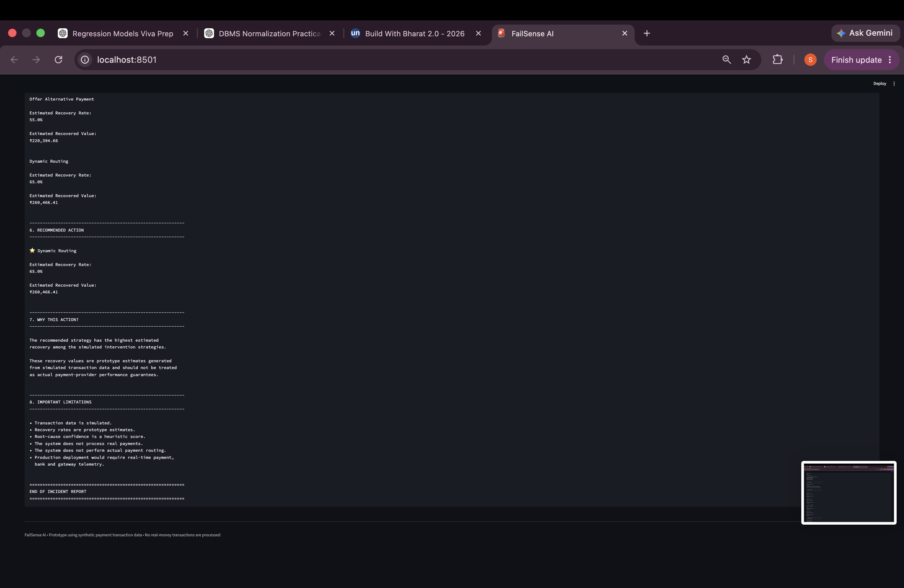

# FailSense AI

An AI-powered payment failure intelligence and recovery copilot designed to detect payment incidents, identify probable root causes, estimate business impact, and recommend recovery strategies.

FailSense AI analyzes payment transaction data and converts raw failures into actionable incident intelligence.

---

# Problem Statement

Payment failures can significantly affect revenue and customer experience.

Traditional payment monitoring systems usually show metrics such as:

- Payment success rate
- Payment failure rate
- Failed transactions
- Payment method performance

However, these metrics do not directly answer important operational questions:

- Is this failure rate abnormal?
- When did the incident start?
- What is the probable root cause?
- Which payment method or bank is affected?
- How many transactions are impacted?
- How much transaction value is at risk?
- Which recovery strategy should be preferred?

FailSense AI addresses these questions through an end-to-end payment failure intelligence pipeline.

---

# Solution

FailSense AI provides a complete workflow:

```text
Transaction Data
       ↓
Data Preprocessing
       ↓
Failure Fingerprinting
       ↓
Time-Window Anomaly Detection
       ↓
Incident Detection
       ↓
Severity Classification
       ↓
Root Cause Analysis
       ↓
Business Impact Estimation
       ↓
Recovery Strategy Simulation
       ↓
AI Investigation Report

Key Features
1. Transaction Monitoring
The system analyzes payment transaction data and tracks:

Transaction status

Payment method

Bank

Transaction amount

Timestamp

Failure patterns

2. Failure Fingerprinting
Each payment failure is converted into a structured failure fingerprint using attributes such as:

Payment method

Bank

Failure category

Failure reason

Example:


UPI_Bank_A_BANK_AUTHORIZATION_TIMEOUT
This helps group similar payment failures.

3. Anomaly Detection
FailSense AI compares normal payment failure behavior with the observed failure rate inside time windows.

The system identifies abnormal spikes using anomaly scores.

Example:


Normal Failure Rate: 2.6%

Incident Failure Rate: 11.28%

Maximum Anomaly Score: 5.28
4. Incident Detection
When the failure rate crosses the configured anomaly threshold, the system creates an incident.

Example:


Incident ID: INC-2026-001
Status: ACTIVE
Severity: HIGH
The incident includes:

Incident window

Affected transactions

Failed transactions

Failure rate

Maximum anomaly score

5. Severity Classification
Incidents are classified according to their observed impact.

Example:


LOW
MEDIUM
HIGH
CRITICAL
This allows operational teams to prioritize serious payment incidents.

6. Root Cause Analysis
The system analyzes failure fingerprints to identify the dominant probable failure pattern.

Example:


Primary Failure Pattern:
UPI_Bank_A_BANK_AUTHORIZATION_TIMEOUT
The system also provides:

Root cause confidence

Pattern share

Matching failures

Example:


Root Cause Confidence: 57.73%
Pattern Share: 12.88%
Matching Failures: 184
7. Business Impact Estimation
FailSense AI estimates the transaction value affected by the incident.

Example:


Affected Transactions: 2066
Failed Transactions: 233
Transaction Value at Risk: ₹400,717.56
This helps translate technical payment failures into business impact.

Recovery Strategy Simulator
The system compares multiple recovery strategies and estimates their potential recovery impact.

Strategies include:

Strategy	Estimated Recovery
Do Nothing	25%
Retry After Delay	40%
Offer Alternative Payment	55%
Dynamic Routing	65%

For the simulated incident, the recommended strategy is:


Dynamic Routing
The simulator estimates potential recovered transaction value based on the recovery rate.

Recovery percentages are prototype estimates used for simulation. No real payment routing or financial transaction is performed.

AI Investigation Report
FailSense AI combines all investigation components into a structured report.

The report contains:

Incident summary

Incident severity

Incident window

Failure rate comparison

Anomaly score

Affected transactions

Primary failure pattern

Root cause confidence

Pattern share

Transaction value at risk

Recovery strategy comparison

Recommended recovery strategy


# Dashboard

The FailSense AI dashboard provides an interactive interface for monitoring transactions, investigating incidents, analyzing root causes, and comparing recovery strategies.

## System Overview

The System Overview provides a high-level view of payment system health, including transaction volume, failure metrics, and system status.



---

## Transaction Analytics

Transaction Analytics provides visual insights into transaction status, payment-method failures, bank-level failures, and transaction-level exploration.



The Transaction Explorer allows users to filter transactions by:

- Payment Status
- Payment Method
- Bank

---

## Active Incident

The Active Incident section displays detected incidents with severity, incident status, affected transactions, failure rate, and incident window.



---

## Root Cause Analysis

The Root Cause Analysis section identifies the dominant probable failure pattern and provides supporting confidence and pattern-share metrics.



---

## Recovery Strategy Simulator

The Recovery Strategy Simulator compares possible recovery actions and estimates their potential recovery impact.



The simulator compares:

- Do Nothing
- Retry After Delay
- Offer Alternative Payment
- Dynamic Routing

The system recommends the strategy with the highest estimated recovery impact.

---

## AI Investigation Report

The AI Investigation Report combines incident detection, root-cause analysis, business impact, and recovery recommendations into a structured investigation.

### Investigation Report — Top



### Investigation Report — Middle



### Investigation Report — Bottom



---


Incident Analysis Workflow
FailSense AI follows the following investigation workflow:

Step 1 — Detect
Monitor payment transactions and identify abnormal failure-rate spikes.

Step 2 — Investigate
Analyze the affected time window and identify the dominant failure patterns.

Step 3 — Diagnose
Determine the probable root cause using failure fingerprints.

Step 4 — Quantify
Estimate affected transactions and transaction value at risk.

Step 5 — Recover
Compare different recovery strategies.

Step 6 — Recommend
Recommend the strategy with the highest estimated recovery impact.

Technology Stack
Programming Language
Python

Data Processing
Pandas

NumPy

Machine Learning / Analytics
Scikit-learn

Statistical anomaly detection

Failure fingerprinting

Backend
FastAPI

Uvicorn

Dashboard
Streamlit

Visualization
Matplotlib

Streamlit charts

Development
Git

GitHub

Python Virtual Environment

Project Structure

failsense-ai/
│
├── backend/
│   └── main.py
│
├── dashboard/
│   └── app.py
│
├── data/
│   └── transactions.csv
│
├── ml/
│   ├── __init__.py
│   ├── ai_investigator.py
│   ├── fingerprint.py
│   ├── generate_data.py
│   ├── impact.py
│   ├── incident.py
│   ├── incident_detector.py
│   ├── inspect_data.py
│   ├── recovery.py
│   ├── root_cause.py
│   └── strategy_engine.py
│
├── screenshots/
│   ├── 01_system_overview.png
│   ├── 02_transaction_analytics.png
│   ├── 03_active_incident.png
│   ├── 04_root_cause_analysis.png
│   ├── 05_recovery_strategy.png
│   ├── 06_ai_investigation_report_top.png
│   ├── 07_ai_investigation_report_middle.png
│   └── 08_ai_investigation_report_bottom.png
│
├── tests/
│
├── docs/
│
├── requirements.txt
├── .gitignore
└── README.md
Installation
Clone the repository:

Bash

git clone https://github.com/sejal24-ux/failsense-ai.git
Navigate to the project:

Bash

cd failsense-ai
Create a virtual environment:

Bash

python3 -m venv venv
Activate the virtual environment:

macOS / Linux
Bash

source venv/bin/activate
Windows
Bash

venv\Scripts\activate
Install dependencies:

Bash

pip install -r requirements.txt
Running the Project
Start the Backend
From the project root:

Bash

uvicorn backend.main:app --reload
The FastAPI backend will start locally.

Start the Dashboard
Open another terminal and run:

Bash

cd failsense-ai
source venv/bin/activate
streamlit run dashboard/app.py
The Streamlit dashboard will open in the browser.

API Endpoints
The backend provides APIs for interacting with the payment intelligence system.

Important endpoints include:


GET /transactions
GET /investigation
The /transactions endpoint provides transaction data for dashboard analytics and filtering.

The /investigation endpoint provides the incident investigation report.

Example Investigation

Incident ID:
INC-2026-001

Severity:
HIGH

Status:
ACTIVE

Normal Failure Rate:
2.6%

Incident Failure Rate:
11.28%

Maximum Anomaly Score:
5.28

Affected Transactions:
2066

Failed Transactions:
233

Primary Failure Pattern:
UPI_Bank_A_BANK_AUTHORIZATION_TIMEOUT

Root Cause Confidence:
57.73%

Pattern Share:
12.88%

Transaction Value at Risk:
₹400,717.56

Recommended Recovery Strategy:
Dynamic Routing
Prototype Scope
FailSense AI currently uses synthetic payment transaction data for demonstration and experimentation.

The project does not:

Process real payments

Move real money

Perform real payment routing

Connect to production banking systems

Execute real recovery actions

Recovery percentages and business impact calculations are prototype estimates.

Future Improvements
Potential future enhancements include:

Real-time payment event ingestion

Streaming anomaly detection

Advanced ML-based root cause classification

Payment gateway integrations

Bank and payment-method health monitoring

Automated alerting

Historical incident comparison

Real-time recovery optimization

Production-grade observability

Authentication and role-based access control

Learning Outcomes
Through this project, the following concepts were implemented:

Payment failure analysis

Data preprocessing

Feature engineering

Failure fingerprinting

Anomaly detection

Incident detection

Root cause analysis

Business impact analysis

Recovery strategy optimization

FastAPI backend development

Streamlit dashboard development

Git and GitHub workflow

GitHub
Repository:

https://github.com/sejal24-ux/failsense-ai

Disclaimer
FailSense AI is a prototype built using synthetic payment transaction data for educational and demonstration purposes.

No real-money transactions are processed.

Author
Sejal Kumari

FailSense AI — Payment Failure Intelligence & Recovery Copilot


